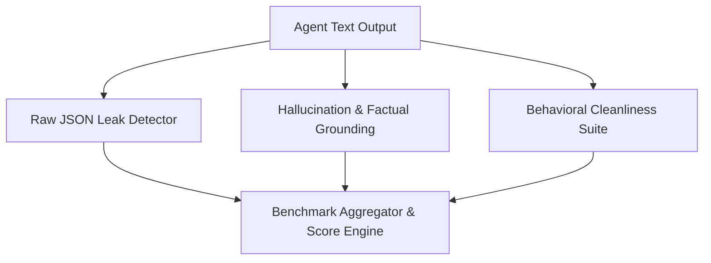

# Architecture: Ayeixa Sentience & Cleanliness Eval

## Overview
Sentience Eval provides automated assertion filters to prevent conversational agent regressions and raw JSON leaks.

## System Topology

